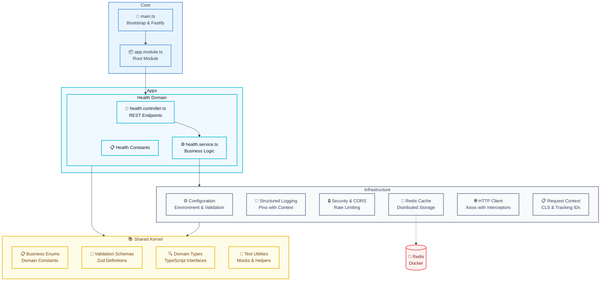

# 🏗️ NestJS Screaming Architecture Template

<p align="center">
  <a href="http://nestjs.com/" target="blank"></a>
</p>

<p align="center">
  <strong>Basic NestJS template implementing Screaming Architecture</strong><br>
  A minimalist and functional foundation to start projects with expressive architecture
</p>

---

## 📖 Description

This is a **basic NestJS template** that implements the fundamentals of **Screaming Architecture**. It's a minimalist implementation that includes only the essentials to start a project with solid and expressive architecture.

**🎯 Minimalist template includes:**

- Base structure of Screaming Architecture
- Health module as domain example
- Docker Compose with Redis for development
- Complete testing (Unit, Integration, E2E)

**🚀 Perfect for:**

- Starting new projects with solid architecture
- Learning Screaming Architecture principles
- Microservices foundation
- Educational and learning projects

## 🎁 Using this Template

This repository is a **public GitHub Template**. You can use it to create new projects:

### Option 1: Use Template on GitHub

1. Go to [this repository on GitHub](https://github.com/willyGaleano/ms-nest-screaming-architecture)
2. Click **"Use this template"** → **"Create a new repository"**
3. Configure your new repository (name, description, visibility)
4. Clone your new repository and follow the installation steps

### Option 2: Clone directly

```bash
# Clone the template
git clone https://github.com/willyGaleano/ms-nest-screaming-architecture.git my-new-project

# Navigate to directory
cd my-new-project

# Remove origin and configure yours
git remote remove origin
git remote add origin https://github.com/your-username/my-new-project.git
```

## 🚀 Features

- **Screaming Architecture**: Structure that clearly expresses the domain
- **Health Checks**: Health endpoint with memory verification
- **Structured Logging**: Implementation with Pino for optimized logs
- **Redis Cache**: Distributed cache system
- **HTTP Client**: HTTP client configured with interceptors
- **Security**: Basic rate limiting and configurable CORS
- **Context Store**: Distributed context management with tracking IDs
- **Variable Validation**: Robust validation with Zod
- **Complete Testing**: Unit, Integration and E2E tests
- **Docker Support**: Complete configuration for development
- **Path Mapping**: Configured aliases for clean imports
- **Git Hooks**: Husky with commitizen and automatic linting

## ⚙️ Installation and Setup

### Prerequisites

- **Node.js v22.16.0** (see `.nvmrc` file)
- **npm** (package manager)
- **Docker Desktop** (for Redis and infrastructure services)

```bash
# If you use nvm, you can install the correct version with:
nvm use
```

### Project Setup

```bash
# 1. Clone from basic branch (if you didn't use the template)
git clone -b feat/basic-screaming-architecture https://github.com/willyGaleano/ms-nest-screaming-architecture.git

# 2. Navigate to directory
cd ms-nest-screaming-architecture

# 3. Install dependencies
npm install

# 4. Copy environment variables file
cp .env.template .env

# 5. Review and adjust variables in .env if necessary
```

### Environment Variables Configuration

The `.env.template` file already includes all necessary configurations for local development. Most work without changes:

```bash
# APP BASE
APP_NAME="ms-nest-screaming-architecture"
HTTP_PORT="3000"
NODE_ENV="development"
ENVIRONMENT="local"

# LOGGER
LOG_LEVEL="debug"
LOGGER_MESSAGE_KEY="msg"
LOGGER_TARGET="pino-pretty"
LOGGER_ERROR_KEY="error"

# SECURITY
THROTTLE_TTL="60000"
THROTTLE_REQUESTS="10"
THROTTLE_BLOCK_DURATION="30000"
CORS_ORIGIN="http://localhost:3000,http://127.0.0.1:3000"
CORS_CREDENTIALS="true"
CORS_METHODS="GET,POST,PUT,DELETE,PATCH,OPTIONS"
CORS_ALLOWED_HEADERS="Content-Type,X-Requested-With,Cache-Control,Authorization,Accept,Origin,x-correlation-id,x-request-id,x-message-id"

# CACHE (Redis via Docker)
REDIS_PORT="6379"
REDIS_PASSWORD="123456"
REDIS_HOST="localhost"
REDIS_USE_TLS="false"

# HTTP CLIENT
HTTP_CLIENT_TIMEOUT="30000"
HTTP_CLIENT_MAX_RATE="1000"
HTTP_CLIENT_MAX_REDIRECTS="5"
HTTP_CLIENT_MAX_RETRIES="3"

# HEALTH
HEALTH_CHECK_MEMORY_HEAP_LIMIT="1000000000" # 1GB
```

### Starting the Project

**Recommended: Use Docker Compose**

```bash
# 1. Start all infrastructure (Redis + App)
docker-compose up -d

# 2. View application logs
docker-compose logs -f app

# 3. Application will be available at http://localhost:3000
```

**Local Development (Optional)**

```bash
# 1. Start only Redis
docker-compose up redis -d

# 2. Run app in development mode
npm run start:dev

# 3. Application will be available at http://localhost:3000
```

### Verify Installation

```bash
# Health check
curl http://localhost:3000/v1/health/check

# Swagger docs
open http://localhost:3000/swagger
```

## 📝 Available Commands

### Docker (Recommended for development)

```bash
# Start all infrastructure
docker-compose up -d

# View logs in real time
docker-compose logs -f app

# Start only Redis
docker-compose up redis -d

# Stop services
docker-compose down

# Complete rebuild
docker-compose up --build -d

# View container status
docker-compose ps

# Access app container
docker-compose exec app sh

# Clean and start from scratch
docker-compose down -v && docker-compose up -d
```

### Local Development

```bash
# Development mode with hot reload
npm run start:dev

# Normal development mode
npm run start

# Debug mode (port 9229)
npm run start:debug

# Build for production
npm run build

# Run production build
npm run start:prod
```

### Testing

```bash
# Unit tests
npm run test

# Tests in watch mode
npm run test:watch

# Tests with coverage
npm run test:cov

# Integration tests (E2E)
npm run test:e2e

# Debug tests
npm run test:debug
```

### Code Quality

```bash
# Linting
npm run lint

# Code formatting
npm run format

# Build project
npm run build
```

### Git and Commits

```bash
# Interactive commit with conventional commits
npm run commit

# Pre-commit hooks will automatically run:
# - ESLint fix
# - Prettier format
# - Commit message validation
```

## 🏗️ Project Structure

The architecture follows the **Screaming Architecture** principle where the folder structure reflects the business domain:

```
src/
├── apps/                    # Domain applications
│   └── health/                 # Health Checks Module
│       ├── controllers/        # REST controllers
│       ├── services/          # Business logic
│       ├── constants/         # Module constants
│       └── tests/             # Specific tests
├── infrastructure/         # Infrastructure layer
│   ├── cache/                 # Cache system (Redis)
│   ├── config/                # Configuration and variables
│   ├── context-store/         # Context management
│   ├── http-client/           # HTTP client
│   ├── logger/                # Logging system
│   └── security/              # Security and rate limiting
├── common/                 # Shared utilities
│   ├── enums/                 # Enumerations
│   ├── schemas/               # Validation schemas
│   ├── types/                 # TypeScript types
│   └── test/                  # Mocks and test utilities
├── app.module.ts           # Main module
└── main.ts                 # Entry point
```

## 🎨 Screaming Architecture



### Architecture Principles

- **"Screams" its purpose**: When you see `src/apps/health/` you immediately know it's a health domain
- **Clear separation**: Domain, infrastructure and shared utilities well defined
- **Controlled dependencies**: Domain doesn't depend on infrastructure
- **Use case oriented**: Each application represents a specific domain

## 🔧 Infrastructure Modules

### Config Module

- **Purpose**: Centralized configuration and environment variables management
- **Features**:
  - Variable validation with Zod
  - Strong typing of configurations
  - Bootstrap service for app initialization
  - Swagger configuration

### Logger Module

- **Purpose**: Structured logging and traceability
- **Features**:
  - Implementation with Pino (high-performance)
  - Interceptor for automatic context binding
  - Structured JSON logs
  - Environment-based configuration

### Security Module

- **Purpose**: Security and rate limiting implementation
- **Features**:
  - Configurable basic rate limiting
  - Customizable CORS
  - Security guards
  - IP-based throttling

### Cache Module

- **Purpose**: Distributed cache system
- **Features**:
  - Redis implementation
  - Decorators for automatic cacheable
  - TTL management
  - String cache helpers

### HTTP Client Module

- **Purpose**: Centralized and configured HTTP client
- **Features**:
  - Axios-based client
  - Automatic interceptors
  - Tracking headers injection
  - Centralized error handling

### Context Store Module

- **Purpose**: Distributed context management
- **Features**:
  - Automatic Request ID and Correlation ID
  - Context binding with CLS (Continuation Local Storage)
  - Cross-service traceability
  - Automatic middleware

## 📱 Apps Modules

### Health Module

- **Purpose**: Health checks and monitoring
- **Features**:
  - Endpoint `/v1/health/check`
  - Memory heap verification
  - Terminus integration
  - Structured responses

## 🛠️ Technologies Used

### Core Framework

- **NestJS 11.x**: Progressive Node.js framework
- **Fastify**: High-performance web framework
- **TypeScript 5.x**: Static typing

### Infrastructure

- **Redis 8.x**: Distributed cache and session store
- **Pino**: High-performance logger
- **Axios**: HTTP client
- **Zod**: Schema validation

### Security and Monitoring

- **@nestjs/throttler**: Rate limiting
- **@nestjs/terminus**: Health checks
- **nestjs-cls**: Context Local Storage
- **UUID**: Unique identifier generation

### Testing

- **Jest**: Testing framework
- **Supertest**: API testing
- **@suites/unit**: Testing utilities
- **@suites/doubles.jest**: Advanced mocking

### Code Quality

- **ESLint**: Code linting
- **Prettier**: Code formatting
- **Husky**: Git hooks
- **Commitizen**: Conventional commits
- **CommitLint**: Commit validation

### DevOps

- **Docker**: Containerization
- **Docker Compose**: Local orchestration

## 📧 Author

**Willy Galeano**

- GitHub: [@willyGaleano](https://github.com/willyGaleano)
- Email: [willyrhcp96@gmail.com](https://mail.google.com/mail/?view=cm&fs=1&to=willyrhcp96@gmail.com)

---

<p align="center">
  Made with ❤️ using NestJS and Screaming Architecture
</p>
