# 🏗️ NestJS Screaming Architecture

<p align="center">
  <a href="http://nestjs.com/" target="blank"></a>
</p>

<p align="center">
  <strong>Enterprise-ready NestJS microservice implementing Screaming Architecture</strong><br>
  A complete and development-ready template with advanced features for building scalable microservices
</p>

---

## 📚 Table of Contents

- [📖 Description](#-description)
- [🎁 Using this Template](#-using-this-template)
- [🚀 Features](#-features)
- [⚙️ Installation and Setup](#️-installation-and-setup)
- [📝 Available Commands](#-available-commands)
- [🏗️ Project Structure](#️-project-structure)
- [🎨 Screaming Architecture](#-screaming-architecture)
- [🔧 Infrastructure Modules](#-infrastructure-modules)
- [📱 Business Domain Modules](#-business-domain-modules)
- [🛠️ Technologies Used](#️-technologies-used)
- [📧 Author](#-author)

---

## 📖 Description

This is a **comprehensive NestJS microservice template** that implements **Screaming Architecture** principles with enterprise-grade features. It provides a solid foundation for building scalable, maintainable, and development-ready microservices.

**🎯 Full-featured template includes:**

- Complete Screaming Architecture implementation
- User management with CQRS pattern
- Notification system with Kafka messaging
- PostgreSQL database with Prisma ORM
- Redis caching layer
- Email notifications with Mailtrap
- Docker Compose orchestration
- Comprehensive testing (Unit, Integration, E2E)
- Health monitoring and observability

**🚀 Perfect for:**

- Development of scalable microservices
- Enterprise applications with complex domains
- Event-driven architectures
- CQRS and DDD implementations
- Learning advanced NestJS patterns

## 🎁 Using this Template

This repository is a **public GitHub Template**. You can use it to create new projects:

### Option 1: Use Template on GitHub

1. Go to [this repository on GitHub](https://github.com/willyGaleano/ms-nest-screaming-architecture)
2. Click **"Use this template"** → **"Create a new repository"**
3. Configure your new repository (name, description, visibility)
4. Clone your new repository and follow the installation steps

### Option 2: Clone directly

```bash
# Clone the template
git clone https://github.com/willyGaleano/ms-nest-screaming-architecture.git my-new-project

# Navigate to directory
cd my-new-project

# Remove origin and configure yours
git remote remove origin
git remote add origin https://github.com/your-username/my-new-project.git
```

## 🚀 Features

- **Screaming Architecture**: Structure that clearly expresses business domains
- **User Management**: Complete CRUD operations with CQRS pattern
- **Notification System**: Multi-channel notifications (Email, SMS, Push)
- **Event-Driven**: Kafka integration for asynchronous messaging
- **Database Layer**: PostgreSQL with Prisma ORM and migrations
- **Caching**: Redis distributed cache with TTL management
- **Email Provider**: Mailtrap integration for email notifications
- **Health Checks**: Memory monitoring and service health endpoints
- **Structured Logging**: Pino logger with request tracing
- **Security**: Rate limiting, CORS, and input validation
- **Context Store**: Request context management with tracking IDs
- **Variable Validation**: Environment validation with Zod
- **Complete Testing**: Unit, Integration, and E2E test suites
- **Docker Support**: Multi-stage builds and development orchestration
- **Path Mapping**: TypeScript path aliases for clean imports
- **Git Hooks**: Husky with commitizen and automated linting

## ⚙️ Installation and Setup

### Prerequisites

- **Node.js v22.16.0** (see `.nvmrc` file)
- **npm** (package manager)
- **Docker Desktop** (for infrastructure services)

```bash
# If you use nvm, you can install the correct version with:
nvm use
```

### Project Setup

```bash
# 1. Clone the repository
git clone https://github.com/willyGaleano/ms-nest-screaming-architecture.git

# 2. Navigate to directory
cd ms-nest-screaming-architecture

# 3. Install dependencies
npm install

# 4. Copy environment variables file
cp .env.template .env

# 5. Review and adjust variables in .env if necessary
```

### Environment Variables Configuration

The `.env.template` file includes all necessary configurations for development. Simply copy it to `.env` and adjust the values as needed for your environment.

**Key configuration sections:**

- **App Settings**: Application name, port, and environment
- **Database**: PostgreSQL connection settings
- **Cache**: Redis configuration
- **Messaging**: Kafka broker settings
- **Security**: CORS and rate limiting
- **Email**: Mailtrap integration for notifications
- **Logging**: Pino logger configuration

### Starting the Project

**Recommended: Use Docker Compose**

```bash
# 1. Start all infrastructure (PostgreSQL + Redis + Kafka + App)
docker-compose up -d

# 2. View application logs
docker-compose logs -f app

# 3. Application will be available at http://localhost:3000
```

**Local Development (Optional)**

```bash
# 1. Start infrastructure services
docker-compose up postgres redis kafka -d

# 2. Run database migrations
npm run prisma:deploy

# 3. Run app in development mode
npm run start:dev

# 4. Application will be available at http://localhost:3000
```

### Verify Installation

**API Documentation:**

- [http://localhost:3000/swagger](http://localhost:3000/swagger)

<p align="center">
  
</p>

**Kafka UI:**

- [http://localhost:8080](http://localhost:8080)

<p align="center">
  
</p>

## 📝 Available Commands

### Docker (Recommended for development)

```bash
# Start all infrastructure
docker-compose up -d

# View logs in real time
docker-compose logs -f app

# Start only infrastructure services
docker-compose up postgres redis kafka -d

# Stop services
docker-compose down

# Complete rebuild
docker-compose up --build -d

# View container status
docker-compose ps

# Access app container
docker-compose exec app sh

# Clean and start from scratch
docker-compose down -v && docker-compose up -d
```

### Local Development

```bash
# Development mode with hot reload
npm run start:dev

# Normal development mode
npm run start

# Debug mode (port 9229)
npm run start:debug

# Build for production
npm run build

# Run production build
npm run start:prod
```

### Database Operations

```bash
# Run Prisma Studio (Database GUI)
npm run prisma:studio

# Generate Prisma client
npm run prisma:generate

# Deploy migrations
npm run prisma:deploy

# Create new migration
npm run prisma:migrate init_migration_name
```

### Testing

```bash
# Unit tests
npm run test

# Tests in watch mode
npm run test:watch

# Tests with coverage
npm run test:cov

# Integration tests (E2E)
npm run test:e2e

# Debug tests
npm run test:debug
```

### Code Quality

```bash
# Linting
npm run lint

# Code formatting
npm run format

# Build project
npm run build
```

### Git and Commits

```bash
# Interactive commit with conventional commits
npm run commit

# Pre-commit hooks will automatically run:
# - ESLint fix
# - Prettier format
# - Commit message validation
```

## 🏗️ Project Structure

The architecture follows **Screaming Architecture** principles where the folder structure reflects business domains:

```
src/
├── apps/                    # Domain applications (Business Logic)
│   ├── health/              # Health Checks Domain
│   │   ├── controllers/     # REST endpoints
│   │   ├── services/        # Business logic
│   │   ├── constants/       # Domain constants
│   │   └── tests/           # Domain-specific tests
│   ├── user/                # User Management Domain
│   │   ├── controllers/     # User REST API
│   │   ├── services/        # User business services
│   │   ├── repositories/    # Data access layer
│   │   ├── features/        # CQRS commands/queries
│   │   ├── dtos/            # Data transfer objects
│   │   ├── types/           # TypeScript types
│   │   └── tests/           # User domain tests
│   └── notification/        # Notification Domain
│       ├── consumers/       # Kafka consumers
│       ├── services/        # Notification logic
│       ├── strategies/      # Strategy pattern implementations
│       ├── factories/       # Factory pattern
│       ├── interfaces/      # Contracts
│       ├── dtos/            # Notification DTOs
│       └── enums/           # Notification types
├── infrastructure/         # Infrastructure layer
│   ├── cache/               # Redis cache system
│   ├── config/              # Configuration and env validation
│   ├── context-store/       # Request context management
│   ├── db/                  # Database (Prisma) integration
│   ├── http-client/         # HTTP client configuration
│   ├── logger/              # Structured logging (Pino)
│   ├── security/            # Security, CORS, rate limiting
│   ├── broker/              # Kafka messaging
│   └── third-party/         # External service integrations
├── common/                 # Shared utilities
│   ├── enums/               # Global enumerations
│   ├── types/               # Shared TypeScript types
│   ├── filters/             # Exception filters
│   ├── decorators/          # Custom decorators
│   ├── utils/               # Utility functions
│   └── tests/               # Test utilities and mocks
├── app.module.ts           # Root application module
└── main.ts                 # Application entry point
```

## 🎨 Screaming Architecture

```mermaid
flowchart TD
    subgraph Core["🎯 Core Bootstrap"]
        direction TB
        Bootstrap["📍 main.ts<br/>Bootstrap & Fastify"]
        AppModule["📦 app.module.ts<br/>Root Module"]
    end

    subgraph Apps["🏢 Business Domains"]
        direction TB
        subgraph Health["💚 Health Domain"]
            HealthController["🎯 health.controller.ts<br/>GET /v1/health/check"]
            HealthService["⚙️ health.service.ts<br/>Memory & Service Checks"]
        end

        subgraph User["👤 User Domain"]
            UserController["🎯 user.controller.ts<br/>CRUD Operations"]
            UserService["⚙️ CQRS Commands/Queries"]
            UserRepo["💾 User Repository<br/>Database Access"]
        end

        subgraph Notification["📧 Notification Domain"]
            NotificationConsumer["📨 Kafka Consumers<br/>Event Processing"]
            NotificationService["⚙️ Multi-channel Notifications"]
            NotificationStrategies["🔄 Email/SMS/Push Strategies"]
        end
    end

    subgraph Infrastructure["🏗️ Infrastructure"]
        direction TB
        Config["⚙️ Configuration<br/>Environment & Validation"]
        Logger["📝 Structured Logging<br/>Pino with Context"]
        Security["🔒 Security & CORS<br/>Rate Limiting"]
        Database["🗄️ PostgreSQL + Prisma<br/>User Entity"]
        Cache["💾 Redis Cache<br/>User Details Cache"]
        HttpClient["🌐 HTTP Client<br/>Axios with Interceptors"]
        ContextStore["📋 Request Context<br/>CLS & Tracking IDs"]
        Kafka["📡 Kafka Broker<br/>Event Streaming"]
        ThirdParty["🔌 Third-party<br/>Mailtrap Email"]
    end

    subgraph Shared["📚 Shared Kernel"]
        direction TB
        Enums["📋 Business Enums<br/>Domain Constants"]
        Types["🔍 Domain Types<br/>TypeScript Interfaces"]
        Filters["🛡️ Exception Filters<br/>Global Error Handling"]
        Decorators["🎨 Custom Decorators<br/>Validation & Metadata"]
        TestUtils["🧪 Test Utilities<br/>Mocks & Helpers"]
    end

    %% Flow Dependencies
    Bootstrap --> AppModule
    AppModule --> Apps
    UserController --> UserService
    UserService --> UserRepo
    UserRepo --> Database
    UserService --> Cache
    UserService --> Kafka
    NotificationConsumer --> NotificationService
    NotificationService --> NotificationStrategies
    NotificationStrategies --> ThirdParty
    HealthController --> HealthService
    Apps --> Infrastructure
    Apps --> Shared
    Infrastructure --> Shared

    %% External Dependencies
    Database -.-> PostgreSQL[("🐘 PostgreSQL<br/>Docker")]
    Cache -.-> Redis[("🔴 Redis<br/>Docker")]
    Kafka -.-> KafkaCluster[("📊 Kafka<br/>Docker")]
    ThirdParty -.-> Mailtrap[("📮 Mailtrap<br/>Email Provider")]

    %% Styling
    classDef core fill:#e8f4fd,stroke:#4a90e2,stroke-width:2px,color:#2c3e50
    classDef domain fill:#f0f9ff,stroke:#06b6d4,stroke-width:2px,color:#0f172a
    classDef infra fill:#f8fafc,stroke:#64748b,stroke-width:2px,color:#334155
    classDef shared fill:#fefce8,stroke:#eab308,stroke-width:2px,color:#713f12
    classDef external fill:#fef2f2,stroke:#ef4444,stroke-width:2px,color:#7f1d1d

    class Bootstrap,AppModule,Core core
    class Health,User,Notification,HealthController,HealthService,UserController,UserService,UserRepo,NotificationConsumer,NotificationService,NotificationStrategies,Apps domain
    class Config,Logger,Security,Database,Cache,HttpClient,ContextStore,Kafka,ThirdParty,Infrastructure infra
    class Enums,Types,Filters,Decorators,TestUtils,Shared shared
    class PostgreSQL,Redis,KafkaCluster,Mailtrap external
```



### Architecture Principles

- **"Screams" its purpose**: Clear domain separation (`apps/user/`, `apps/notification/`)
- **Domain-driven**: Each app represents a bounded context
- **CQRS pattern**: Separated command and query responsibilities
- **Event-driven**: Kafka integration for asynchronous communication
- **Clean dependencies**: Domain doesn't depend on infrastructure
- **Testable**: Comprehensive test coverage at all levels

## 🔧 Infrastructure Modules

### Config Module

- **Purpose**: Centralized configuration and environment variables
- **Features**:
  - Zod validation for type-safe environment variables
  - Bootstrap service for application initialization
  - Swagger API documentation setup
  - Multi-environment support

### Logger Module

- **Purpose**: Structured logging and distributed tracing
- **Features**:
  - High-performance Pino logger
  - Request context binding
  - Correlation ID tracking
  - Structured JSON logs
  - Environment-based configuration

### Security Module

- **Purpose**: Application security and protection
- **Features**:
  - Configurable rate limiting with Redis
  - CORS configuration
  - Request throttling
  - Security headers
  - IP-based blocking

### Database Module

- **Purpose**: PostgreSQL database integration
- **Features**:
  - Prisma ORM with type safety
  - Migration management
  - Connection pooling
  - Base repository pattern
  - Transaction support

### Cache Module

- **Purpose**: Distributed caching system
- **Features**:
  - Redis implementation
  - String cache helpers
  - TTL management
  - Cache invalidation
  - Development utilities

### HTTP Client Module

- **Purpose**: External API communication
- **Features**:
  - Axios-based client
  - Request/response interceptors
  - Automatic retry logic
  - Timeout configuration
  - Error handling

### Context Store Module

- **Purpose**: Request context management
- **Features**:
  - Correlation ID generation
  - Request ID tracking
  - Context binding with CLS
  - Cross-service traceability
  - Automatic middleware

### Kafka Module

- **Purpose**: Event streaming and messaging
- **Features**:
  - Producer and consumer services
  - Topic management
  - Error handling and retries
  - Message serialization
  - Consumer group management

### Third-party Module

- **Purpose**: External service integrations
- **Features**:
  - Mailtrap email service
  - HTTP client configuration
  - Service abstraction
  - Error handling
  - Response validation

## 📱 Business Domain Modules

### Health Module

- **Purpose**: Application health monitoring
- **Features**:
  - Memory heap monitoring
  - Service health checks
  - Endpoint: `GET /v1/health/check`
  - Terminus integration
  - Prometheus-ready metrics

### User Module

- **Purpose**: User management with CQRS
- **Features**:
  - Complete CRUD operations
  - Command/Query separation
  - Database persistence with Prisma
  - Cache integration for user details
  - Event publishing for user actions
  - **Endpoints**:
    - `POST /v1/users` - Create user
    - `GET /v1/users/:id` - Get user details
    - `PUT /v1/users/:id` - Update user
    - `DELETE /v1/users/:id` - Delete user

### Notification Module

- **Purpose**: Multi-channel notification system
- **Features**:
  - Email notifications via Mailtrap
  - Strategy pattern for notification types
  - Kafka consumer for async processing
  - Support for Email, SMS, and Push notifications
  - Template-based messaging
  - Error handling and retries

## 🛠️ Technologies Used

### Core Framework

- **NestJS 11.x**: Progressive Node.js framework
- **Fastify**: High-performance web framework
- **TypeScript 5.x**: Static typing and modern JavaScript

### Database & ORM

- **PostgreSQL 17.x**: Robust relational database
- **Prisma 6.x**: Type-safe database client
- **Prisma Migrate**: Database migrations

### Messaging & Events

- **Kafka 7.x**: Distributed event streaming
- **KafkaJS**: Node.js Kafka client
- **@nestjs/cqrs**: Command Query Responsibility Segregation

### Caching & Storage

- **Redis 8.x**: In-memory data structure store
- **Redis Cluster**: Distributed caching

### Monitoring & Logging

- **Pino**: High-performance logger
- **@nestjs/terminus**: Health checks
- **nestjs-cls**: Context Local Storage
- **UUID**: Unique identifier generation

### Security & Validation

- **@nestjs/throttler**: Rate limiting
- **class-validator**: DTO validation
- **class-transformer**: Object transformation
- **Zod**: Schema validation

### Testing

- **Jest**: Testing framework
- **Supertest**: HTTP assertion library
- **@suites/unit**: Advanced testing utilities
- **@suites/doubles.jest**: Mock and stub utilities

### Code Quality

- **ESLint**: Code linting with TypeScript support
- **Prettier**: Code formatting
- **Husky**: Git hooks automation
- **Commitizen**: Conventional commits
- **CommitLint**: Commit message validation

### DevOps & Deployment

- **Docker**: Containerization
- **Docker Compose**: Local orchestration
- **Multi-stage builds**: Optimized production images

### External Services

- **Mailtrap**: Email delivery service
- **Axios**: HTTP client library

## 📧 Author

**Willy Galeano**

- GitHub: [@willyGaleano](https://github.com/willyGaleano)
- Email: [willyrhcp96@gmail.com](mailto:willyrhcp96@gmail.com)

---

<p align="center">
  Made with ❤️ using NestJS and Screaming Architecture
</p>
